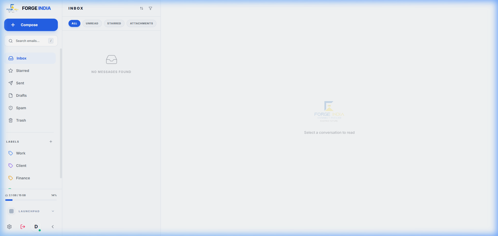
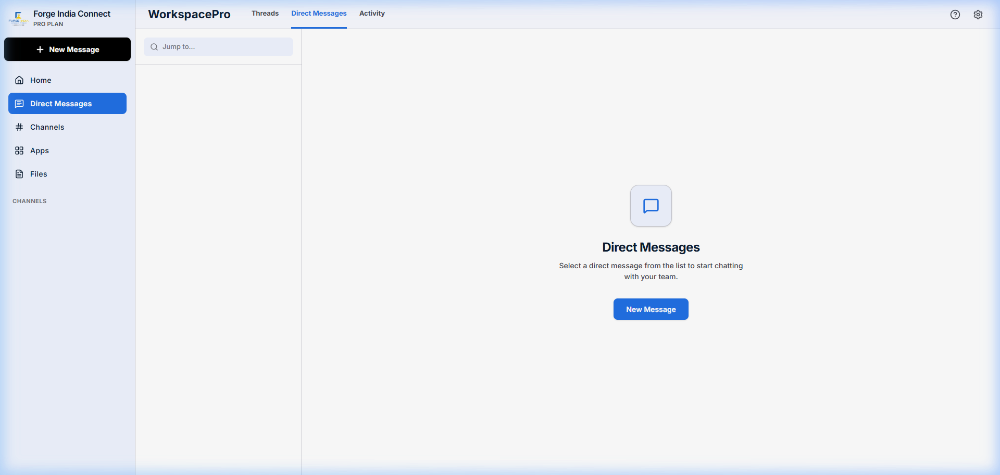
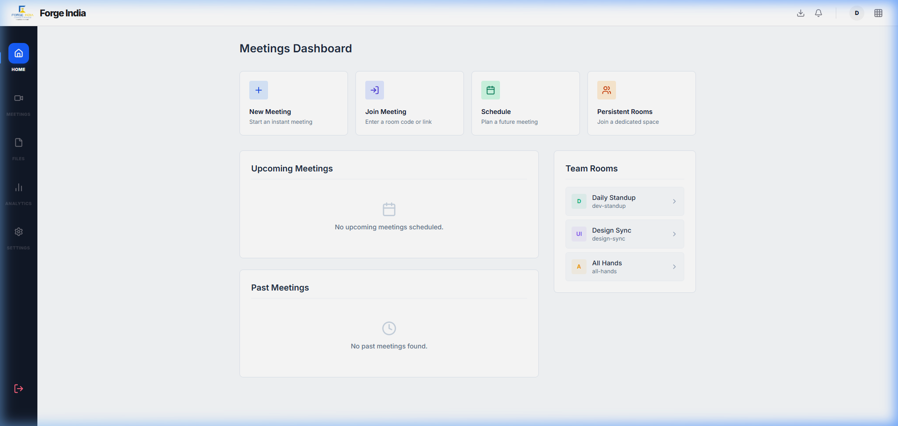
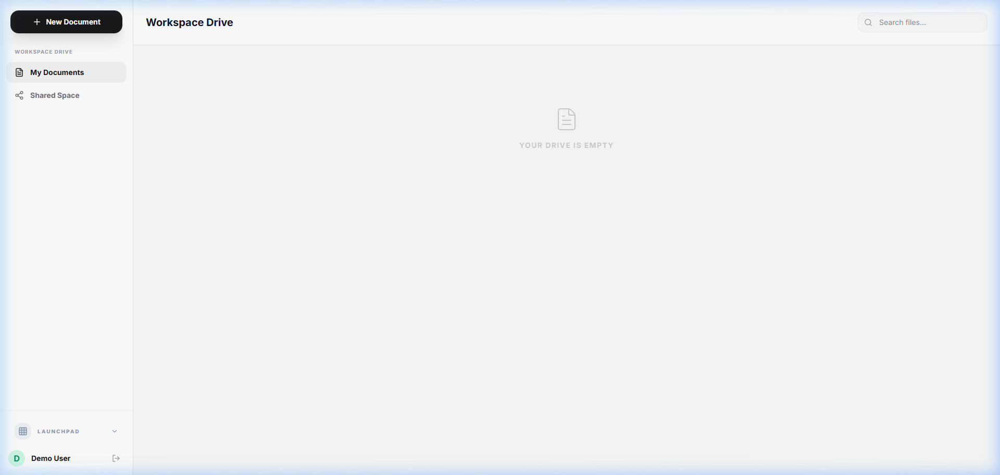
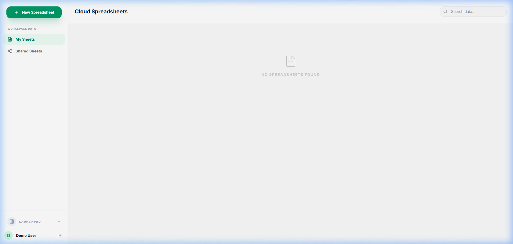
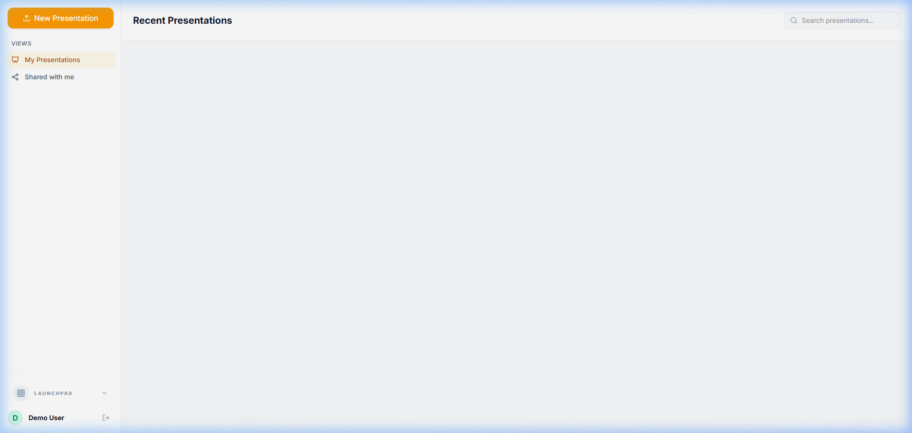
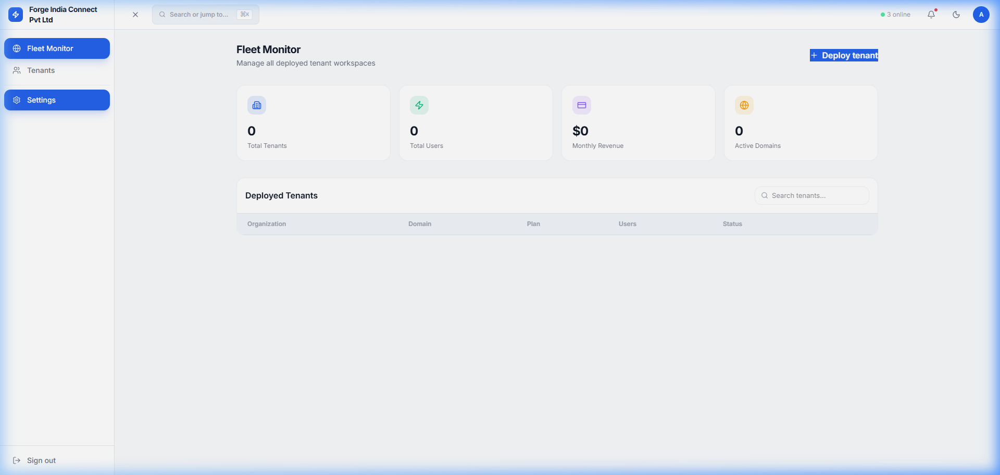

# Forge India Workspace - Complete System Documentation

Welcome to the comprehensive technical and user manual for the **Forge India Workspace** platform. This document serves as the complete operational guide outlining every core application, its extensive features, typical and advanced user workflows, and detailed visual dashboards.

Forge Connect is designed to unify team collaboration, document management, unified communications, and administrative oversight into one cohesive SaaS OS.

---

## 💻 Technologies Used
The Forge India Workspace Web Application is built on a modern, high-performance web stack:
- **Frontend**: React 19, Vite (Build Tool), TailwindCSS v4 (Styling), Zustand (State Management), Framer Motion (Animations).
- **Backend & Real-Time**: Node.js, Fastify (API Server), Socket.io (WebSockets for chat/presence).
- **Database & Storage**: MongoDB (Mongoose ORM) for persistent data, Cloudinary/AWS for media.
- **Core Integrations**: WebRTC & Simple-Peer (Video/Audio), TipTap (Rich-Text Docs), React Data Grid (Sheets), and Google Generative AI / Groq / OpenAI (Meeting summarization and AI assistants).

---

## 1. Mail (Secure Email Application)
**Endpoint Route**: `/w/:workspaceId/mail`

The Mail application is a highly secure, enterprise-grade email client integrated directly into the workspace. It eliminates the need to switch contexts between external email providers and internal tools, securely managing both internal communication and external correspondence.

### Deep Dive: Core Functions & Capabilities
- **Unified Inbox & Advanced Filtering**: The primary inbox view aggregates all incoming communications. Users can leverage advanced search syntax via the top search bar (accessible via the `/` shortcut) to filter by sender, date, attachment status, and keyword.
- **Dynamic Labeling & Categorization**: Beyond standard folders (Starred, Sent, Drafts, Spam, Trash), the system supports custom, color-coded labels (e.g., Work, Client, Finance). These labels are applied dynamically and can be used to construct smart inboxes.
- **Rich Text Composer with Inline Media**: The compose modal is a full-featured rich-text editor supporting complex HTML formatting, inline image embedding, signature management, and drag-and-drop file attachments directly from the local file system or other workspace apps.
- **Storage Quota & Utilization**: A real-time storage indicator situated in the sidebar actively tracks utilized space against the organizational limit (e.g., 2.1 GB / 15 GB), preventing bounce-backs and ensuring compliance.

### End-to-End User Workflow
1. **Navigating and Triaging**: Upon opening the Mail app, the user lands in the Inbox. Unread messages are distinctly bolded. The user can select multiple emails via checkboxes to apply bulk actions (archive, mark as read, delete, or label).
2. **Reading & Responding**: Clicking an individual email expands the reading pane. The user can review the thread history seamlessly, utilizing the quick-reply box at the bottom of the thread or opening a full compose window for comprehensive responses.
3. **Composing a New Message**: By clicking the prominent `+ Compose` button (or using the `C` keyboard shortcut), the compose modal overlays the screen. The user inputs recipient addresses (which auto-complete from the workspace directory), types the subject and body, attaches necessary files, and hits send.
4. **Organizing**: As the inbox fills, the user drags emails directly onto specific labels in the sidebar to categorize them, maintaining an organized "Inbox Zero" workflow.

### Dashboard Visualization

---

## 2. Kural / Chat (Real-Time Team Messaging)
**Endpoint Route**: `/w/:workspaceId/chat`

Known internally as **Kural**, the Chat application is the central hub for synchronous communication. It facilitates instantaneous dialogue through Direct Messages (DMs) and topic-specific Channels.

### Deep Dive: Core Functions & Capabilities
- **Persistent Direct Messages & Read Receipts**: Private 1-on-1 conversations feature persistent history, typing indicators, and read receipts, ensuring accountability and transparency in communication.
- **Public & Private Channels**: Teams can collaborate in dedicated spaces. Public channels are discoverable by anyone in the workspace, while Private channels require explicit invitations.
- **Rich Media & File Stream**: The chat interface supports rich media natively. Users can drag-and-drop videos, images, code snippets, and documents directly into the chat. Media is previewed inline.
- **Presence & Status Indicators**: A sophisticated presence system tracks whether colleagues are Online, Away, Do Not Disturb, or Offline, allowing for respectful and timely communication.
- **Message Threading**: Complex conversations can be neatly nested into threads, preventing the main channel from becoming cluttered and allowing specific discussions to be tracked easily.

### End-to-End User Workflow
1. **Discovering Conversations**: The left sidebar organizes all active communications. The top section lists pinned channels, followed by standard channels, and finally Direct Messages. Unread indicators guide the user's attention.
2. **Engaging in Channels**: The user selects a channel (e.g., `#engineering-updates`). They can scroll back to read past context, reply directly to a specific message to start a thread, or post a new top-level message using the rich input field at the bottom.
3. **Sharing Resources**: The user clicks the attachment icon (or drags a file) to upload a document to the chat. They can add a caption before hitting send.
4. **Setting Status**: If the user needs to focus, they click their profile avatar in the sidebar and select "Do Not Disturb," pausing all desktop notifications temporarily.

### Dashboard Visualization

---

## 3. Meet / Meetings (Video Conferencing & Huddles)
**Endpoint Route**: `/w/:workspaceId/meet`

The Meetings application is an enterprise video conferencing solution built for high-fidelity communication, robust analytics, and AI-driven post-meeting intelligence.

### Deep Dive: Core Functions & Capabilities
- **High-Definition Video Rooms**: Secure, low-latency video calls supporting gallery view, speaker view, and high-resolution screen sharing. Rooms can be locked by the host to prevent uninvited attendees.
- **Comprehensive Meeting Analytics**: The dashboard tracks key metrics such as total meeting duration, average participant engagement scores, talk-time distribution, and historical attendance records.
- **AI-Powered Meeting Summarizer**: Integrating advanced language models, the app automatically transcripts the meeting and generates actionable notes, summaries, and categorized action items immediately after the call concludes.
- **Interactive In-Call Tools**: Participants have access to an in-call text chat, reaction emojis (raised hand, applause), and collaborative whiteboarding tools.
- **Calendar Synchronization**: Tight integration with the user's calendar allows for seamless scheduling, one-click joining of upcoming huddles, and automated reminder notifications.

### End-to-End User Workflow
1. **Reviewing the Dashboard**: The user lands on the Meeting Home dashboard. They review upcoming meetings for the day in the schedule pane and check their weekly analytics in the overview cards.
2. **Starting an Ad-Hoc Call**: The user clicks "New Meeting." A secure room link is generated instantly. They copy the link and share it via the Chat app with their team.
3. **Conducting the Meeting**: Inside the room, the host mutes participants on entry. They share their screen to present a document. Other participants use the "Raise Hand" feature to ask questions without interrupting the flow.
4. **Post-Meeting Review**: Once the call ends, the user navigates to the "Meeting Analytics" tab. They open the auto-generated AI summary, review the action items, and distribute the minutes to the team via the Mail app.

### Dashboard Visualization

---

## 4. Docs (Collaborative Word Processor)
**Endpoint Route**: `/w/:workspaceId/docs`

Docs is a robust, collaborative rich-text editor engineered for concurrent authoring, extensive formatting, and seamless document management.

### Deep Dive: Core Functions & Capabilities
- **Real-Time Co-Authoring**: Multiple users can edit a single document simultaneously. Cursor tracking and color-coded tags show who is typing where, in real-time, preventing version conflicts.
- **Advanced Formatting Engine**: Comprehensive styling options including multi-level headings, typography controls, blockquotes, code blocks with syntax highlighting, and complex nested lists.
- **Integrated AI Assistant**: A contextual AI panel is available alongside the document. Users can prompt the AI to draft new sections, rewrite paragraphs for tone, summarize long texts, or check for grammatical errors.
- **Structured File Management**: A hierarchical folder system allows organizations to structure their knowledge base effectively. A dedicated "Recently Viewed" section provides quick access to active work.

### End-to-End User Workflow
1. **Navigating the Explorer**: The user opens the Docs app and uses the left sidebar to navigate through folders (e.g., `Marketing > Q3 Campaigns`).
2. **Creating & Editing**: They click "New Document" and begin drafting a campaign brief. They format the document using the top toolbar, adding headings and bullet points.
3. **Leveraging AI**: Stuck on an introduction, the user highlights the first paragraph, clicks the AI sparkle icon, and selects "Rewrite to be more professional." The AI replaces the text instantly.
4. **Collaborating**: The user shares the document link with a colleague. The colleague joins the session, their cursor appears, and they begin adding comments and editing the conclusion concurrently.

### Dashboard Visualization

---

## 5. Sheets (Data Grids & Spreadsheets)
**Endpoint Route**: `/w/:workspaceId/sheets`

Sheets provides a powerful, highly performant grid interface for financial modeling, data aggregation, and complex tabular tracking.

### Deep Dive: Core Functions & Capabilities
- **Performant Grid Architecture**: Capable of handling thousands of rows and columns with smooth scrolling and instantaneous cell updates without browser lag.
- **Comprehensive Formula Engine**: Supports standard mathematical, statistical, and logical functions. Formulas update reactively as dependent cell values change.
- **Advanced Cell Formatting**: Users can apply conditional formatting, adjust text alignment, change font colors, apply borders, and format numbers (currency, percentages, dates) via the intuitive toolbar.
- **Multi-Sheet Workbooks**: Complex datasets can be organized across multiple interconnected worksheets within a single workbook file.

### End-to-End User Workflow
1. **Workbook Initialization**: The user opens a financial projection workbook from the Sheets dashboard.
2. **Data Entry & Manipulation**: They input new monthly revenue figures into a specific column. They click the cell and type the data directly or use the formula bar.
3. **Applying Formulas**: In the totals row, the user types `=SUM(B2:B12)` to calculate the annual revenue. The cell instantly reflects the computed total.
4. **Formatting for Presentation**: The user highlights the header row, applies a bold font, changes the background color to a light blue, and formats the numeric columns to display as currency for easier reading.

### Dashboard Visualization

---

## 6. Show (Presentation & Slide Builder)
**Endpoint Route**: `/w/:workspaceId/show`

Show is a dynamic presentation application designed to rapidly transform ideas into visually compelling slide decks, augmented by powerful AI generation tools.

### Deep Dive: Core Functions & Capabilities
- **Visual Slide Editor**: A WYSIWYG canvas allows users to place, resize, and style text boxes, geometric shapes, icons, and images with pixel-perfect precision.
- **AI Deck Generation**: A standout feature that accepts a simple topic prompt and automatically generates a complete, multi-slide presentation with structured outlines, relevant imagery, and formatted layouts.
- **Seamless PPTX Export**: Fully finalized presentations can be exported natively to the `.pptx` format, ensuring compatibility with external clients using Microsoft PowerPoint.
- **Immersive Presenter Mode**: A distraction-free full-screen mode for delivering presentations, complete with slide transitions and navigation controls.

### End-to-End User Workflow
1. **Bootstrapping a Deck**: Short on time, the user opens Show, navigates to the AI Generator panel, and types "Q4 Strategy Update." The AI churns for a moment and produces a 10-slide deck with a title, agenda, key metrics, and conclusion.
2. **Refining the Content**: The user clicks through the generated slides using the left thumbnail navigation. They select text boxes on the canvas to update specific figures and replace placeholder images.
3. **Arranging Elements**: They drag a chart image onto a slide, resize it using the corner handles, and bring it to the front of the stacking order.
4. **Delivery & Export**: The user clicks "Present" to rehearse the flow in full-screen. Satisfied, they click the "Download PPTX" button in the header to share the file externally.

### Dashboard Visualization

---

## 7. Tasks (Kanban Project Management)
**Endpoint Route**: `/w/:workspaceId/tasks`

The Tasks application is an intuitive project management tool centered around a Kanban board methodology, allowing teams to visualize workflows and track deliverables.

### Deep Dive: Core Functions & Capabilities
- **Customizable Kanban Columns**: Boards are structured into vertical columns representing statuses (e.g., Backlog, To Do, In Progress, Review, Done).
- **Frictionless Drag-and-Drop**: The core interaction model allows users to pick up task cards and fluidly drag them between columns to update their status instantly.
- **Rich Task Modals**: Clicking a card opens a detailed view where users can assign team members, set due dates, add descriptive markdown text, and attach relevant files or links.
- **Sprint & Project Organization**: Tasks can be grouped into distinct boards representing specific product sprints or departmental projects, keeping workflows segregated and focused.

### End-to-End User Workflow
1. **Board Assessment**: The user opens the primary Engineering board to review the current sprint's status. They quickly gauge bottlenecks by seeing too many cards piled up in the "Review" column.
2. **Task Creation**: During a daily standup, a new bug is reported. The user clicks "Add Card" at the bottom of the "To Do" column, titles it "Fix Login UI Glitch," and hits enter.
3. **Task Detailing**: They click the newly created card, assign it to a frontend developer, set the priority to "High," and add a description of the bug.
4. **Tracking Progress**: The assigned developer logs in, sees the task, and drags the card from "To Do" into "In Progress." Once the bug is fixed, they drag it to "Done."

### Dashboard Visualization

---

## 8. Admin (Super Admin Dashboard)
**Endpoint Route**: `/super-admin`

The Admin Dashboard provides comprehensive governance, security, and analytical oversight for workspace administrators, ensuring the platform runs smoothly and securely.

### Deep Dive: Core Functions & Capabilities
- **Granular User Lifecycle Management**: Administrators can invite new employees via email, assign specific access roles (e.g., Member, Manager, Admin), temporarily suspend accounts, or permanently revoke access.
- **Workspace Analytics & Telemetry**: The main dashboard provides a macro-view of organizational health, displaying active user counts, total storage consumption, and engagement metrics across different applications.
- **Security & Authentication Configuration**: Admins can enforce security protocols, such as mandating Two-Factor Authentication (2FA), configuring Single Sign-On (SSO) providers, and managing password complexity rules.
- **Billing & Subscription Handling**: Centralized management of the organization's subscription tier, payment methods, and invoice history.

### End-to-End User Workflow
1. **System Health Check**: The administrator logs into the Super Admin route and reviews the top-level metric cards to ensure storage limits are not being exceeded and user activity is normal.
2. **Onboarding a New Hire**: The admin navigates to the "Users" tab, clicks "Invite User," enters the new employee's email address, and assigns them the "Member" role with access to a specific sub-workspace.
3. **Auditing Access**: Periodically, the admin searches the user list to identify inactive accounts or contractors whose contracts have expired, revoking their access with a single click.
4. **Configuring Preferences**: The admin switches to the "Settings" tab to update the workspace name, change the company logo displayed in the sidebar, and enforce a new session timeout policy for security compliance.

### Dashboard Visualization

